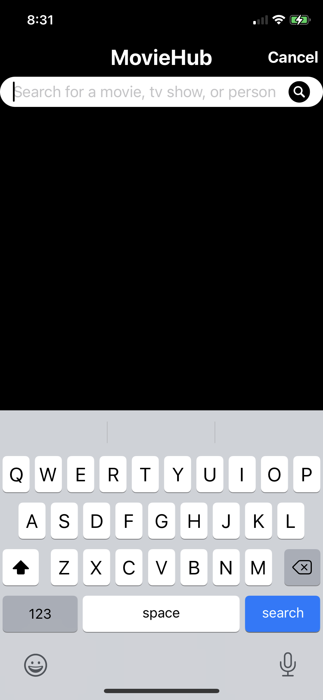
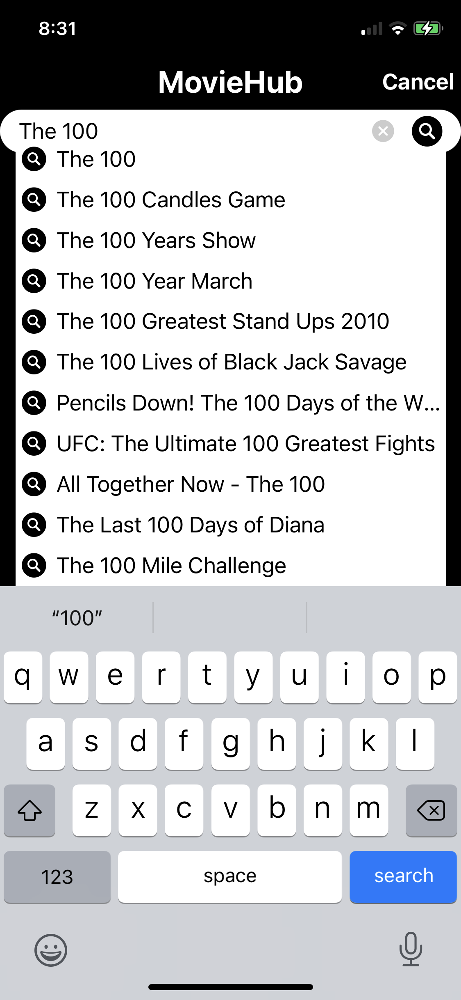
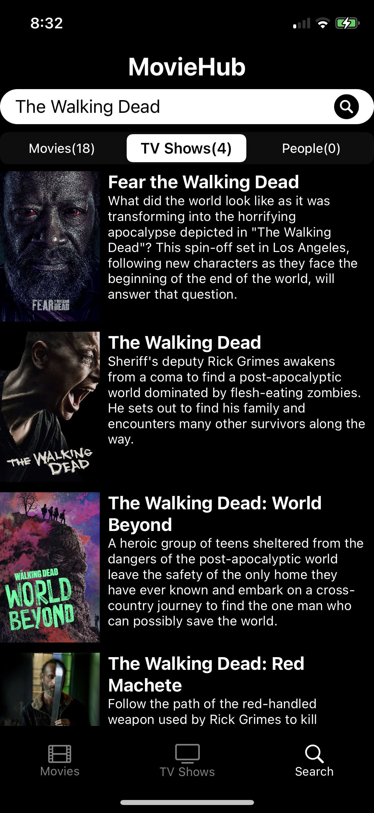
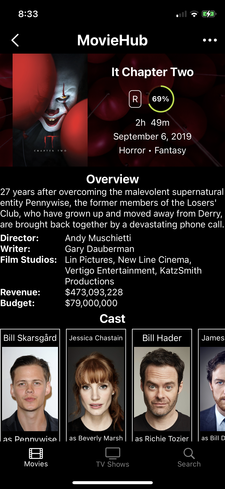
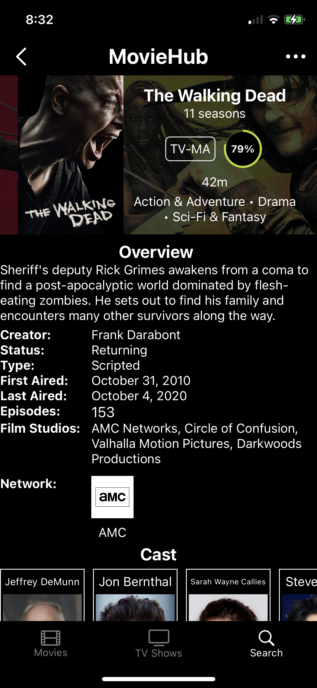
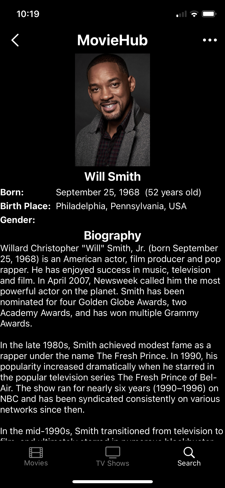
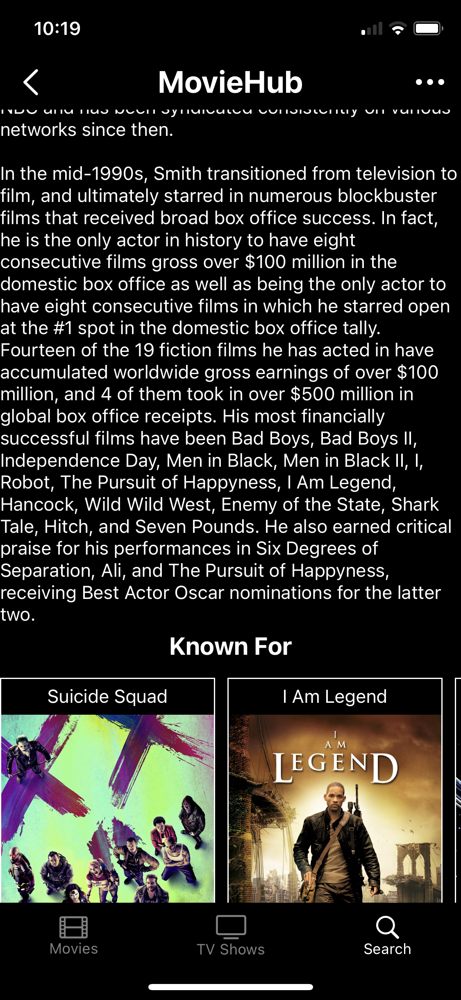
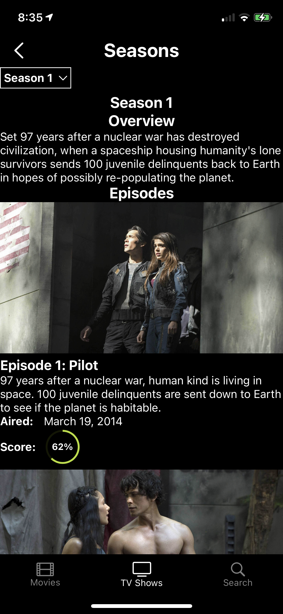

# MovieHub
iOS application that allows users to view movie and tv show information. The app connects to The Movie Database(TMDb) to get movie and tv show data. Users can browse movies and tv shows by category. They can also search for a specific movie, tv show, or person.

## Screenshots

### Movie Category View
The user can tap on a category to view the movies associated with that category.

### TV Show Category View
The user can tap on a category to view the tv shows associated with that category.

### Search View
The user can search for a specific movie, tv show, or person. The search bar also supports autofill.

### Movie Detail View
The user can view movie information such as movie title, rating, score, film studios, release date, overview, directors, writers, reviews, cast, trailers, and similar movies. The trailers are in a page view so the user can swipe to see other trailers if the movie has more than one trailer.

### TV Show Detail View
The user can view tv show information such as title, rating, score, film studios, first aired date, last aired date, overview, creators, episode count, season count, status, type, reviews, cast, trailers, and similar tv shows. The trailers are in a page view so the user can swipe to see other trailers if the tv show has more than one trailer.

### Person Detail View
The user can view information about a specific person such as name, gender, birthday, deathday, birthplace, biography, movies, and tv shows.

### Review View
The user can view reviews posted by people on The Movie Database(TMDb).

### Season View
The user can view season information such as episode details and season trailers. 

